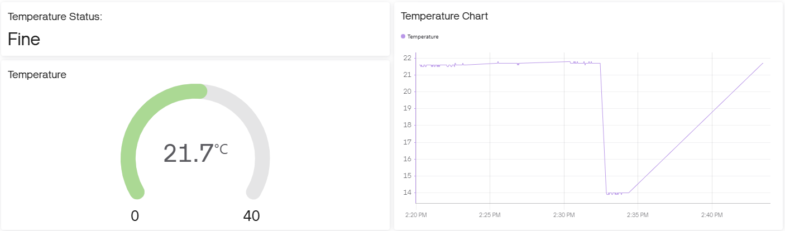
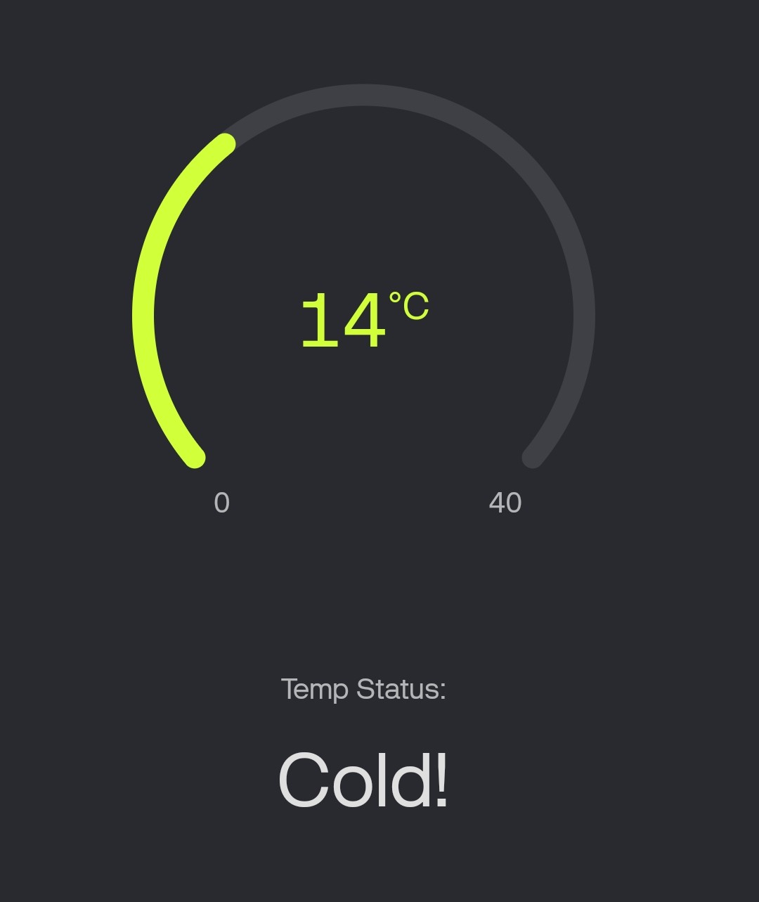

# Temperature Monitoring System

A temperature monitoring system built with a **Raspberry Pi 4** and **Sense HAT** that:

- Reads ambient temperature in real time
- Displays status messages on the Sense HAT LED matrix
- Classifies temperature as **HOT**, **COLD**, or **FINE**
- Sends temperature data to the **Blynk IoT App**
- Allows remote monitoring through a mobile device

---

## Hardware Requirements

- Raspberry Pi 4
- Sense HAT
- MicroSD card with Raspberry Pi OS
- Power supply
- Internet connection (for Blynk)
- Smartphone/PC with Blynk App

---

## Software Requirements

- Raspberry Pi OS
- Python 3
- Sense HAT Python library
- Blynk library

---

## Installation

### 1. Update Raspberry Pi
sudo apt-get update

### 2. Install Sense HAT
sudo apt-get install sense-hat

### 3. Reboot
sudo reboot

## Run LED Temperature Monitor 
python temp-monitor.py

## Run Blynk App Temperature Monitor

### Create Python virtual environment
python -m venv .venv --system-site-packages

### Activate virtual environment
source .venv/bin/activate

### Install Blynk dependencies
pip install https://bit.ly/3C0PMVY

### Create Blynk virtual pin
export BLYNK_AUTH="eQW_41fc48GdNj-xGus9cZgQ4vD7N5Dg"

### Run Blynk Script
python blynk.py

## View Output in Blynk App
Create account and follow quickstart guides.
https://docs.blynk.io/en/getting-started/what-do-i-need-to-blynk
Set up dashboard as below for **V0 - Temperature** and **V1 - Temperature Status Message**

### Desktop Dashboard

### Mobile Dashboard
